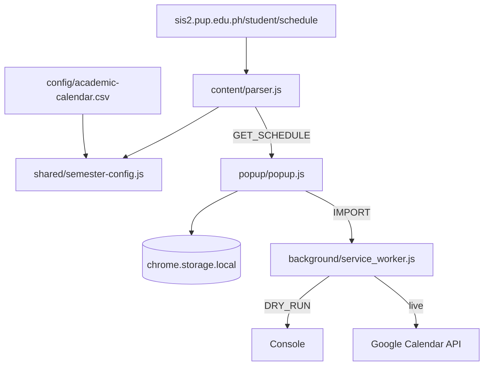

# ARCHITECTURE — PUPSync

Monolithic **Chrome Extension (Manifest V3)**. No backend.

See [SPEC.md](SPEC.md), [CONFIG.md](CONFIG.md), [API.md](API.md).

---

## File structure

```
pupsync/
├── manifest.json
├── config/
│   ├── academic-calendar.csv    # YOU EDIT — term start/end dates
│   └── README.md
├── background/
│   └── service_worker.js        # Import loop, DRY_RUN, Calendar API (2b)
├── content/
│   └── parser.js                # SIAS table + page term
├── popup/
│   ├── popup.html / popup.css / popup.js
│   └── logo.svg
├── shared/
│   ├── constants.js
│   ├── utils.js                 # Schedule string + event builder
│   └── semester-config.js       # Loads CSV, resolves dates
├── dev/                         # npm run dev preview
├── test/
└── icons/
```

---

## Data flow



---

## Parsed objects

### SubjectEntry (from table)

`subjectCode`, `description`, `lectureHours`, `labHours`, `units`, `section`, `days[]`, `lectureTime`, `labTime`, `faculty`, `parseError?`, `excluded`

### TermInfo (from heading + CSV)

`schoolYearCode`, `semester`, `displayLabel`, `shortLabel`, `semesterStart`, `semesterEnd`, `dateSource` (`csv-override` | `csv-rule` | `builtin`)

---

## Storage (`chrome.storage.local`)

| Key | Content |
|-----|---------|
| `subjectColors` | `{ "INTE 202": "Peacock", ... }` |
| `semesterStart` | ISO date |
| `semesterEnd` | ISO date |
| `lastSchedule` | Last parsed subjects |
| `lastTerm` | Last resolved term |
| `oauthToken` | Phase 2b |

---

## Permissions

```json
{
  "permissions": ["identity", "storage", "scripting", "activeTab"],
  "host_permissions": [
    "*://sis2.pup.edu.ph/*",
    "https://www.googleapis.com/*"
  ]
}
```

---

## Constraints

- Client-side only; `Asia/Manila` timezone for MVP
- Term dates: **CSV overrides** > CSV rules > built-in templates
- `DRY_RUN = true` in `shared/constants.js` until OAuth is configured
