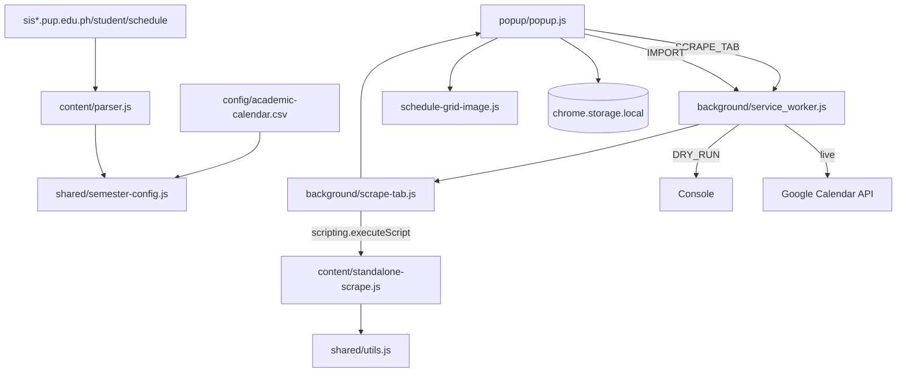

# ARCHITECTURE — PUPSync

Monolithic **Chrome Extension (Manifest V3)**. No backend.

See [SPEC.md](SPEC.md), [CONFIG.md](CONFIG.md), [API.md](API.md).

---

## File structure

```
pupsync/
├── manifest.json
├── config/
│   ├── academic-calendar.csv    # YOU EDIT — term start/end dates
│   └── README.md
├── background/
│   ├── service_worker.js      # Import, CSV proxy, message router
│   └── scrape-tab.js          # SCRAPE_TAB → scripting inject
├── content/
│   ├── parser.js              # Content script on SIAS (GET_SCHEDULE)
│   ├── page-scrape.js         # DOM scrape helper (injected)
│   └── standalone-scrape.js   # Entry for popup/service-worker inject
├── popup/
│   ├── popup.html / popup.css / popup.js
│   └── logo.svg
├── shared/
│   ├── constants.js
│   ├── utils.js               # Parse, meetings, events, week grid model
│   ├── schedule-grid-image.js # SVG preview + PNG export for week grid
│   ├── gwa-share-image.js     # Shareable GWA PNG card
│   └── semester-config.js     # Loads CSV, resolves dates
├── dev/                         # npm run dev preview
├── test/
└── icons/
```

---

## Data flow



**Why `SCRAPE_TAB`:** Popup cannot rely on `chrome.webNavigation.getAllFrames` or fragile double-injection. The service worker injects `constants.js`, `utils.js`, and `standalone-scrape.js` into all frames and picks the best parse result.

**CSV load:** Content script fetches `academic-calendar.csv` via extension URL; on failure, `GET_ACADEMIC_CSV` message to the service worker.

---

## Parsed objects

### SubjectEntry (from table)

`subjectCode`, `description`, `lectureHours`, `labHours`, `units`, `section`, `days[]`, `meetings[]`, `lectureTime`, `labTime`, `faculty`, `parseError?`, `excluded`

### Meeting

`day`, `time` (`start`/`end` 24h), `type` (`Lecture` | `Lab`)

### TermInfo (from heading + CSV)

`schoolYearCode`, `semester`, `displayLabel`, `shortLabel`, `semesterStart`, `semesterEnd`, `dateSource` (`csv-override` | `csv-rule` | `builtin`)

---

## Storage (`chrome.storage.local`)

| Key | Content |
|-----|---------|
| `subjectColors` | `{ "INTE 202": "Peacock", ... }` |
| `semesterStart` | ISO date |
| `semesterEnd` | ISO date |
| `lastSchedule` | Last parsed subjects |
| `lastTerm` | Last resolved term |
| `oauthToken` | Phase 2b |

---

## Permissions

```json
{
  "permissions": ["identity", "storage", "scripting", "activeTab"],
  "host_permissions": [
    "*://*.pup.edu.ph/*",
    "https://www.googleapis.com/*"
  ]
}
```

Content scripts match `*://*.pup.edu.ph/student/schedule*`.

---

## Constraints

- Client-side only; `Asia/Manila` timezone for MVP
- Term dates: **CSV overrides** > CSV rules > built-in templates
- `DRY_RUN = true` in `shared/constants.js` until OAuth is configured
