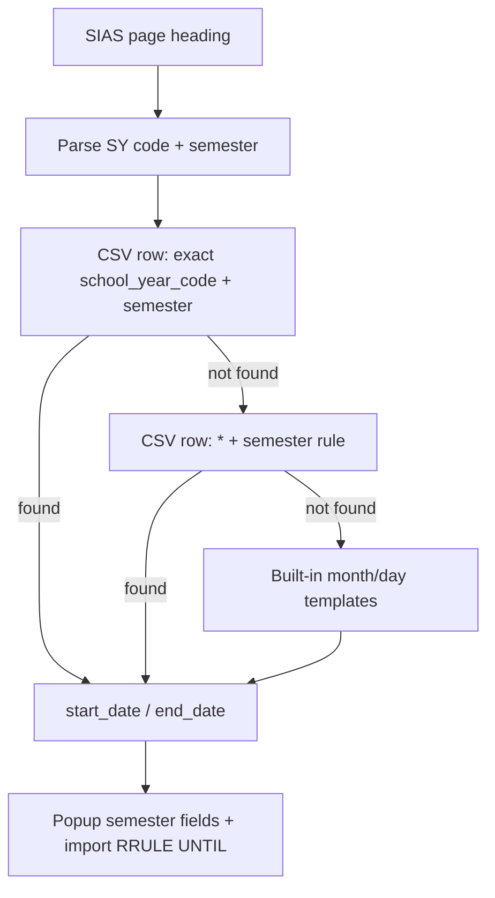

# CONFIG — Academic calendar file

PUPSync resolves **semester start/end dates** for Google Calendar import using a file you control:

**[`pupsync/config/academic-calendar.csv`](../pupsync/config/academic-calendar.csv)**

Short reference: [`pupsync/config/README.md`](../pupsync/config/README.md)

---

## Why this exists

SIAS shows a heading like:

`School Year 2526 - Second Semester`

The extension parses that automatically, but **official class dates** should come from a source you trust (PUP announcements, registrar calendar). The CSV is where you set those dates once per term — no code edits.

---

## Resolution order



---

## What you edit each term

Add or update an **override** row:

```csv
school_year_code,semester,start_date,end_date,...
2526,Second,2026-01-05,2026-05-31,...
```

When the page says `School Year 2526 - Second Semester`, that row is used.

---

## Rule rows (fallback)

Rows with `school_year_code` = `*` apply to **any** SY when no override exists:

```csv
*,Second,,,1,1,5,31,end,...
```

Only change these if PUP’s **pattern** changes (e.g. all 2nd semesters always January–May).

---

## After saving

1. Save `academic-calendar.csv`
2. Reload extension at `chrome://extensions`
3. Open popup on [SIAS schedule](https://sis2.pup.edu.ph/student/schedule)

Popup shows: `Detected from page: SY 2526 (2025–2026) · Second Semester (csv-override)`

---

## Columns reference

| Column | Override rows | Rule rows (`*`) |
|--------|---------------|-----------------|
| `school_year_code` | `2526` | `*` |
| `semester` | `First`, `Second`, … | same |
| `start_date` | `YYYY-MM-DD` | empty |
| `end_date` | `YYYY-MM-DD` | empty |
| `start_month`, `start_day` | empty | e.g. `8`, `1` |
| `end_month`, `end_day` | empty | e.g. `5`, `31` |
| `sy_year_part` | empty | `start` or `end` (year from SY code) |
| `notes` | optional | optional |

Lines starting with `#` are comments.

---

## No-class dates

[`pupsync/config/no-class-dates.json`](../pupsync/config/no-class-dates.json) lists holidays, vacations, and exam weeks per school year + semester. The SIAS heading (`School Year 2627 - First Semester`) selects the block. Import attaches matching dates as `EXDATE` on weekly class events so those days get no regular lecture/lab occurrences.

Edit this file when PUP publishes a new calendar. Exam finals should use the union of graduating and non-graduating windows. If a SY/semester is missing, import proceeds with no exclusions.
