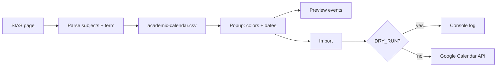

# SPEC — PUPSync: Schedule Import Chrome Extension

**Version:** 0.1.0-MVP  
**Status:** In development  
**Last Updated:** 2026-05-28

---

## Overview

PUP students view class schedules on the SIAS portal as a non-downloadable HTML table. **PUPSync** is a client-side Chrome Extension (Manifest V3) that:

1. Parses the schedule table and page heading on any SIS host (`sis1`, `sis2`, …) at `/student/schedule`
2. Resolves semester dates from **[config/academic-calendar.csv](../pupsync/config/academic-calendar.csv)** (you edit this file each term)
3. Lets students pick Google Calendar colors per subject
4. Creates recurring calendar events (dry-run locally; live import after Google Cloud setup)

No backend server.

---

## Goals (MVP)

| Goal | Status |
|------|--------|
| Parse SIAS schedule table → structured subjects | Done |
| Parse page heading → school year + semester | Done |
| Resolve term dates from editable CSV + fallbacks | Done |
| Popup: week grid + list, color chip/dropdown, preview, import | Done |
| Local dry-run import (no OAuth) | Done (`DRY_RUN`) |
| Live Google Calendar import | Planned (OAuth + Cloud project) |

---

## Non-Goals (MVP)

- Mobile / Firefox
- Push notifications
- Outlook / Apple Calendar / `.ics` export (image export covers sharing)
- Multi-calendar selection, duplicate detection on re-import
- Grade or enrollment features

---

## Target Users

- **Primary:** PUP BSIT / BSCS / BSIS students importing schedules to Google Calendar
- **Secondary:** Faculty using the same SIAS schedule view

---

## Feature Requirements

### 1. Schedule table parser

- **URL:** `https://sis{N}.pup.edu.ph/student/schedule` (e.g. sis1, sis2)
- **Detection:** table with headers `Subject Code`, `Description`, `Schedule`
- **Output per subject:** `subjectCode`, `description`, `lectureHours`, `labHours`, `units`, `section`, `days[]`, `meetings[]`, `lectureTime`, `labTime`, `faculty`
- **Faculty:** inline in Schedule cell (`Faculty: …`) or legacy sub-row
- **Meetings:** one entry per day/time slot after PUP day-pairing (`T/F`, `M/TH`, `S/S`, etc.) and lec/lab classification
- **SSR:** immediate DOM scan + `MutationObserver` fallback

**Day codes:** `M`, `T`, `W`, `TH`, `F`, `S`; `S/S` = two **Saturday** blocks (not Sunday); `/` pairs days with times by index

**Schedule string:** `{SECTION} - {DAYS} {TIME1}/{TIME2}` — see parser pseudocode in repo `shared/utils.js`

### 2. School year & semester parser

- **Source:** page heading e.g. `School Year 2526 - Second Semester`
- **Parsed:** `schoolYearCode` = `2526`, `semester` = `Second`
- **SY code:** `2526` → academic years **2025–2026** (first two digits = start year, last two = end year)

### 3. Semester dates (config file)

- **Primary:** [`pupsync/config/academic-calendar.csv`](../pupsync/config/academic-calendar.csv) — **you maintain this**
- **Override rows:** exact `start_date` / `end_date` per `school_year_code` + `semester`
- **Rule rows:** `*` + semester → month/day template
- **Fallback:** built-in templates in `shared/semester-config.js`
- Popup shows detected term; dates editable before import
- See [CONFIG.md](CONFIG.md)

### 4. Popup schedule views

- **Week grid:** visual timetable (default); popup expands to 600px
- **List:** per-subject rows with checkboxes and color chips
- Auto-assign distinct colors on first load (`autoAssignSubjectColors`)

### 5. Color selection

- One **color chip** per subject (dot + dropdown)
- 11 Google Calendar colors; persisted in `chrome.storage.local`

### 6. Google Calendar export

- One recurring event per `meetings[]` entry (not per raw day string)
- Timezone: `Asia/Manila`
- **Phase 2a:** dry-run logs payloads to service worker console
- **Phase 2b:** OAuth + `calendar.events` API — see [API.md](API.md)

---

## Import pipeline (target behavior)

---

## Milestones

| Phase | Scope | Status |
|-------|-------|--------|
| 1 | MV3 scaffold, parser, popup UI | Done |
| 2a | Dry-run import, preview, dev server | Done |
| 2b | Google Cloud + live Calendar API | Not started |
| 3 | Polish, edge cases, publish checklist | Partial |

---

## Open Questions

| # | Question | Status |
|---|----------|--------|
| 1 | SIAS table SSR vs JS? | Resolved — SSR; observer kept as fallback |
| 2 | Exact schedule URL? | Resolved — `sis*.pup.edu.ph/student/schedule` |
| 3 | Re-import: delete old events? | Open — MVP creates new events |
| 4 | Non-primary calendar? | Deferred v0.2 |
| 5 | OAuth client registration? | Open — required for Phase 2b |

---

## Future Versions

- **v0.2:** Calendar picker, duplicate detection
- **v1.0:** Firefox, shareable schedule links
